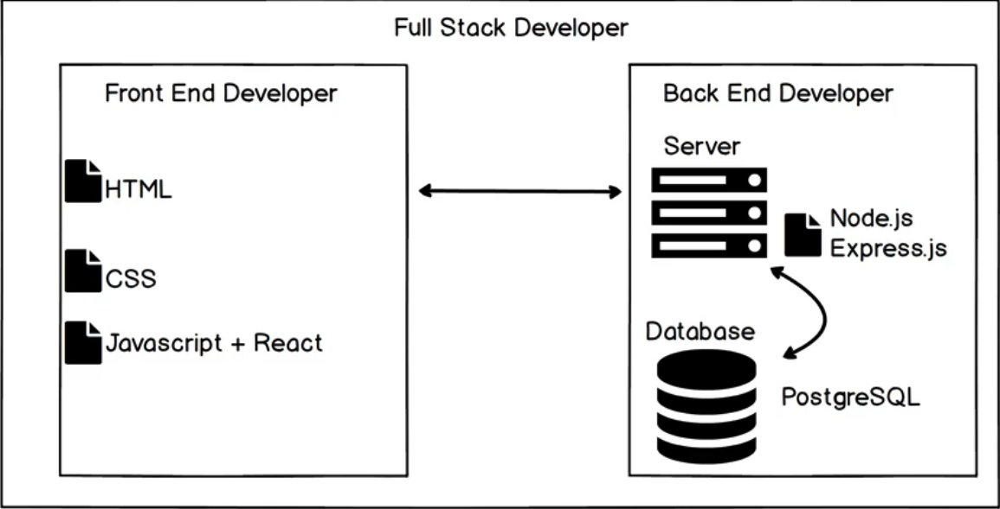
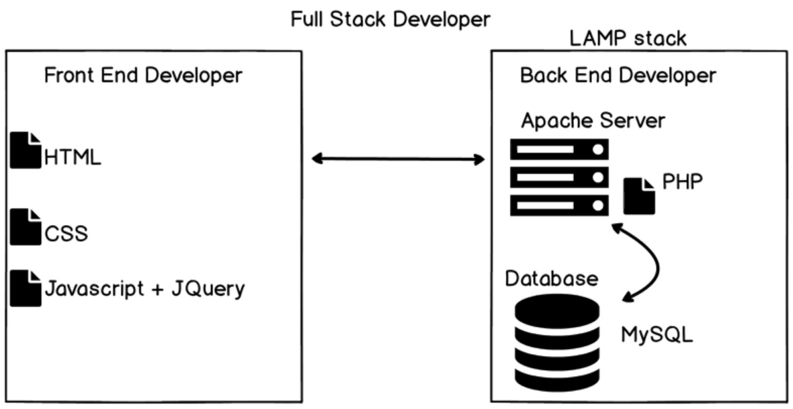

# Internet
- we are going to the very basics to reimplement our foundations so here's some notes I took

- Internet backbone is basically this network all over the world of connected cables so that we can transfer files all over the world
    - https://www.submarinecablemap.com/ 
    - so yeah, basically all these connected computers transferring files between each other

## traceroute
- we can monitor the process of how from our wifi at home to the wireless transmitter to isp network to internet backbone
- mac terminal it's `traceroute`, windows it would be `tracert`
    - moment you run something like `traceroute google.com` it will show you how many hops it took to find the address of Google for you.
    - fun way to see where your request goes
    - all those ip addresses are different computers trying to locate

## Instructor claims
- claims that without a single line of code, we now know how to improve website's performance
    - location of server (closer is better)
    - how many trips (less trips is better)
    - size of files 

## Full stack developer:
- front end developer: make sure we open a browser, goes to a site and we see something 
- back end developer: works with server and when browser speaks to it, makes sure it serves up those files
- 

## WWW
- Tim Berners-Lee, 1989 invented the World Wide Web (WWW)
- [internet maps history](https://www.voc.com/a/internet-maps)
    - internet started with ARPNET in 1969 (military project)
    - It was really hard to share academic papers with one another
        - each computers had their own ways of doing things (like different foreign language)
- Tim made the WWW, a common language for the computers to use to speak with one another
    - think of the internet as phone, and WWW is instagram that runs on the phone
        - problem is... I never used instagram before
- Tim created the first web server, web browser, and first web site
- [The first website link](http://info.cern.ch/hypertext/WWW/TheProject.html)
    - it actually still exists

## HTML, CSS, JS
- HTML: Hyper-text markup language: is a way to write text on a website
    - and can have things like hyperlinks that leads to other pages on website
- 1995, 1996 2 new technologies came into being: CSS and JS
    - CSS solves problem of making a website look nicer
        - if you go into chrome developer tools on website, you can inject CSS in the Style sections
    - JS added in more interactivity onto a website
        - if you go into the console within developer tools, you can play with JS (e.g. alert('hello world!'))
- There's many browsers (Chrome, Firefox, Safari ...)
    - All has to agree on how to read HTML, CSS, JS files
    - Now we even have a lot of mobile devices (mobile devices)
        - have to consider making look nice on smaller screens

## Developer History
- back then full stack developer was
    - Front end: HTML, CSS, JS+Jquery (Jquery is becoming obsolete now)
    - LAMP stack (Linux, Apache, MYSQL, PHP)
        - PHP files that gave logic to servers, not much growth with this language
        - Apache Server efficiently served up files
    - 
- Here's instructor's version of latest full stack web developer
    - [new full stack](images/newFullStack.png "new full satck developer")
    - Front end: HTML5, CSS3, JS+React
    - Back end: Node.js, Express.js, PostgreSql, MongoDB
    

# **GOOGLE IS YOUR FRIEND**
- Stack Overflow is a good place to find answers